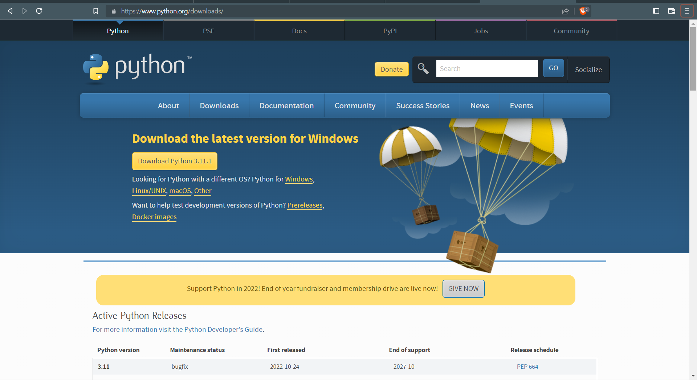
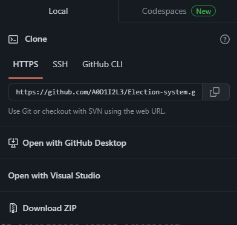
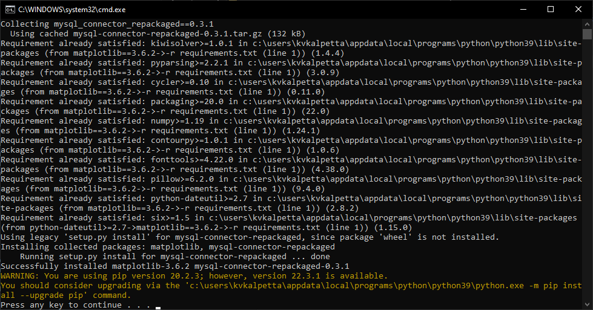
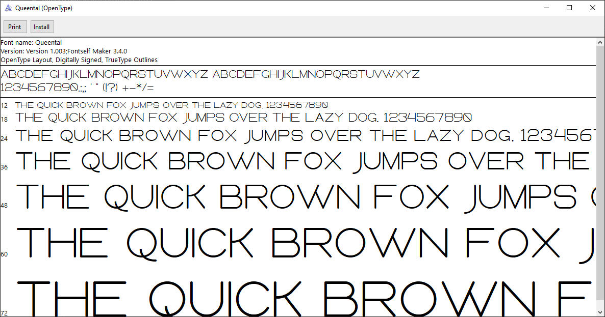

<div align="center">

  <h1> Election  System Using Python and tkinter</h1>
  
<sub>Authors: <a>Adil Haneef, Athul Krishna, Sreerag Unni N </a><br>
<small> January, 2023</small></sub>

</div>

---

## Introduction 


 - Minimal app for organising Elections completely programmed using Python and frontend using Python-tkinter
 - Data entry using Python and tkinter into Database managed by Mysql
  
## Features
- Fully controlled by admin 
- Result in Pie as well as bar graphs
- Ability to host main database in one system and vote to it through other systems
  
## Requirements
To actually use this project for your advantage you need the following
- Balls
- Motivation
- IQ >5
- Ability to follow the instructions given

## Basic Setup
I believe you my friend , have all the requirements mentioned above

So lets get started 

### Install python 3 (preferably 3.10)
Entire code runs on Python. Install [Python for windows](https://www.python.org/downloads/).

After downloading double click and install
We can check if node is installed on our local machine by opening our device terminal or command prompt.
```sh
$ python --version
Python 3.10.7
```

### Download git repository

Download ZIP and extract OR
### Clone git repository
Open git Bash.
Change the current working directory to the location where you want the cloned directory.
```sh
$ git clone https://github.com/A0D1I2L3/Election-system.git
> Cloning into 'Election-system'...
>remote: Enumerating objects: 135, done.
>remote: Counting objects: 100% (135/135), done.
>remote: Compressing objects: 100% (93/93), done.
>Receiving objects:  57% (77/135)used 104 (delta 33), pack-reused 0
>Receiving objects: 100% (135/135), 21.42 KiB | 4.28 MiB/s, done.
>Resolving deltas: 100% (59/59), done.
```

### Install All Required Python 3 Modules.

Modules

  - matplotlib
  - mysql-connector
  - tkinter

Use autorun.bat to install all required modules (Windows)

Double-Click on autorun.bat in Election-system.

Now, Click any key to close cmd window.

OR

You can install modules using PIP
```
pip install MODULE-NAME
```


#### Fonts used

- Queental
- Consolas Bold

#### Installing fonts

Open fonts folder in the repository.
Install one by one



## Connectivity setup(mysql-)

1. Open MySQL 8.0 Command Line Client and login with your password
2. Create a user with create option
    ```
    mysql> Create user 'root'@'%' identified by 'password';
    Query OK, 0 rows affected (0.11 sec)
    ```
    >Replace % with IP address for slected  IP
3. Grant privelegs to user
    ```
    mysql> Grant select on database_name.* to 'root'@'%';
    Query OK, 0 rows affected (0.06 sec)
    ```
    ```
    mysql> Grant all privileges on database_name.* to 'root'@'%';
    Query OK, 0 rows affected (0.01 sec)
    ```
    eg:-
    ```
    mysql> Grant select,update on *.* to 'root'@'%';
    Query OK, 0 rows affected (0.02 sec)
    ```
4. ```
    mysql> flush privileges;
    Query OK, 0 rows affected (0.02 sec)
    ```
5. Mysql user and passwd is 'root'and 'tiger' respectively, You might need to change in [adminside.py (line 8)](adminside.py) 
   
6. You may need to change [voterside.py (line 5)](voterside.py) to
    ```
    import mysql.connector as broker
    mydb = broker.connect(host='<IP of admin system>',user='root', password='<yourpassword>')
    ```

<p>You are basically done with the setup.. enjoy voting(no one ever)</p>

---
